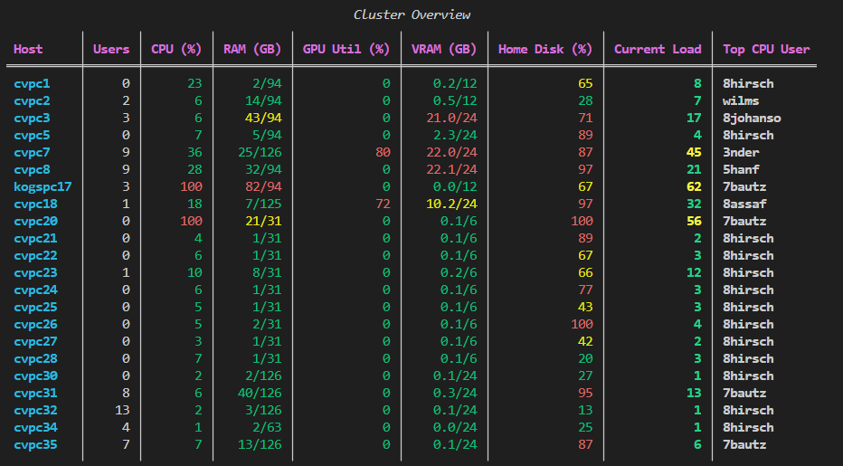

# Usage

`uvx remote-gpu-stats <username>` where `<username>` is your SSH username for the informatik pcs.

## Authentication

By default you are prompted for your SSH password.

- Set the `REMOTE_GPU_STATS_PASSWORD` environment variable to skip the prompt, e.g. for unattended use.
- Or create a `.env` file in the project root containing `REMOTE_GPU_STATS_PASSWORD=...` (it is gitignored).
- Use `--use-default-key` to opt in to SSH key authentication with `~/.ssh/id_ed25519` (or `~/.ssh/id_rsa`). Key auth is never used unless this flag is given; the password prompt remains the default. The public half of the key must be installed on the gateway and each host (see `ssh-copy-id`).

## Options

| Flag                | Description                                                                                      |
|---------------------|--------------------------------------------------------------------------------------------------|
| `--use-default-key` | Authenticate with your local SSH key instead of a password (see above).                          |

Hosts that do not respond within 5 seconds are skipped and reported as such; the remaining hosts are still collected.

# Example

https://www.inf.uni-hamburg.de/inst/irz/infrastructure/news.html